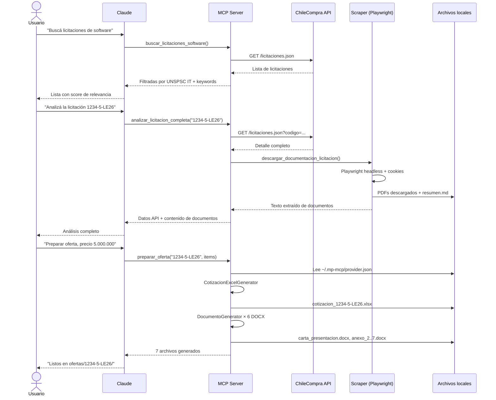
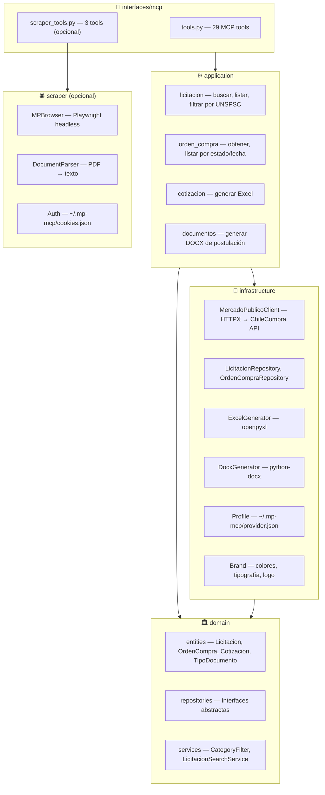

# MCP Mercado Público

Servidor MCP que automatiza el flujo completo de licitaciones en [ChileCompra](https://www.mercadopublico.cl). Conecta Claude con la API de Mercado Público para buscar licitaciones de desarrollo de software, descargar documentación, generar cotizaciones Excel y producir los documentos de postulación estándar listos para subir.

## Funcionalidades

- **Búsqueda inteligente** — filtra licitaciones por keywords y códigos UNSPSC (IT, software, servicios TI)
- **Descarga de documentos** — descarga automatizada desde el portal usando sesión autenticada
- **Cotización Excel** — genera planilla `.xlsx` profesional con items, totales, IVA y datos de empresa
- **Documentos de postulación** — genera los 6 anexos estándar chilenos en DOCX (carta presentación, declaración probidad, conflicto de intereses, aceptación de bases, datos transferencia, pacto de integridad)
- **Flujo completo** — `preparar_oferta()` ejecuta todo de una sola llamada

## Requisitos

- Python 3.11+
- [uv](https://docs.astral.sh/uv/getting-started/installation/) — gestor de paquetes Python
- API Key de Mercado Público ([registrarse aquí](https://www.mercadopublico.cl))

---

## Instalación

### Opción A — Claude Desktop (recomendado para usuarios finales)

Un solo comando instala todo y configura Claude Desktop automáticamente:

```bash
python install.py
```

El instalador:
1. Verifica Python 3.11+
2. Instala `uv` si no está presente
3. Instala el paquete scraper con Playwright
4. Instala el servidor MCP
5. Configura `claude_desktop_config.json` con tu ticket de API
6. Ofrece ejecutar el login del scraper

Reiniciá Claude Desktop al terminar. El servidor `mercado-publico` aparecerá disponible.

---

### Opción B — Claude Code CLI (usuarios de terminal)

Si usás Claude Code CLI (`claude` en terminal), instalá directamente desde el marketplace:

```
/plugin marketplace add shinsekai-dev/mp-mcp
/plugin install mp-mcp
```

El CLI te pedirá tu `MERCADO_PUBLICO_TICKET` durante la instalación.

---

## Primera vez (ambas opciones)

### 1. Autenticar el scraper (una sola vez por máquina)

El scraper necesita cookies de sesión para descargar documentos del portal:

```bash
cd scraper
uv run mp-scraper login
# Se abre Chrome → hacé login en mercadopublico.cl → presioná ENTER
```

Las cookies se guardan en `~/.mp-mcp/cookies.json` y se reusan automáticamente.

Para verificar desde Claude: `verificar_sesion_scraper()`

### 2. Guardar perfil de empresa (una sola vez desde Claude)

```
guardar_perfil_proveedor({
  "empresa": "Nombre de tu empresa",
  "rut": "76.XXX.XXX-X",
  "representante_legal": "Nombre Apellido",
  "direccion": "Dirección completa",
  "telefono": "+56 9 XXXX XXXX",
  "email": "contacto@empresa.cl",
  "giro": "Desarrollo de software"
})
```

Se guarda en `~/.mp-mcp/provider.json`. Todas las tools lo usan automáticamente — no tenés que volver a ingresarlo.

---

## Uso típico

```
1. buscar_licitaciones_software()
   → lista licitaciones TI activas, ordenadas por relevancia

2. analizar_licitacion_completa("1464-74-LE25")
   → datos completos + descarga automática de todos los documentos

3. preparar_oferta("1464-74-LE25", [
     {"correlativo": 1, "descripcion": "Desarrollo sistema", "precio_unitario_neto": 5000000}
   ])
   → genera Excel de cotización + 6 documentos DOCX listos para subir
```

---

## Variables de entorno

| Variable | Requerida | Default | Descripción |
|---|---|---|---|
| `MERCADO_PUBLICO_TICKET` | Sí | — | API Key de ChileCompra |
| `MERCADO_PUBLICO_BASE_URL` | No | `https://api.mercadopublico.cl/servicios/v1/publico` | Base URL |
| `MP_SCRAPER_COOKIES_PATH` | No | `~/.mp-mcp/cookies.json` | Cookies del scraper |
| `MP_PROFILE_PATH` | No | `~/.mp-mcp/provider.json` | Perfil de proveedor |

---

## Herramientas MCP disponibles

```mermaid
graph LR
    subgraph BUSQUEDA["🔍 Búsqueda de licitaciones"]
        B1["buscar_licitaciones_software"]
        B2["buscar_licitaciones_por_nombre"]
        B3["filtrar_licitaciones_por_categoria"]
        B4["listar_licitaciones_activas"]
        B5["listar_licitaciones_por_organismo"]
        B6["listar_licitaciones_por_proveedor"]
        B7["obtener_licitacion"]
        B8["obtener_items_licitacion"]
    end

    subgraph OC["📋 Órdenes de compra"]
        O1["listar_ordenes_compra_hoy"]
        O2["listar_ordenes_compra_por_estado"]
        O3["listar_ordenes_compra_por_fecha"]
        O4["listar_ordenes_compra_por_organismo"]
        O5["listar_ordenes_compra_por_proveedor"]
        O6["obtener_orden_compra"]
    end

    subgraph SCRAPER["🕷️ Scraper (requiere login)"]
        S1["verificar_sesion_scraper"]
        S2["descargar_documentacion_licitacion"]
        S3["obtener_resumen_licitacion"]
    end

    subgraph OFERTA["📄 Generar oferta"]
        G1["generar_cotizacion_excel"]
        G2["generar_documento_licitacion"]
        G3["generar_documentos_licitacion"]
        G4["listar_tipos_documentos"]
    end

    subgraph FLUJO["⚡ Flujo completo"]
        F1["analizar_licitacion_completa"]
        F2["preparar_oferta"]
    end

    subgraph PERFIL["👤 Perfil de empresa"]
        P1["guardar_perfil_proveedor"]
        P2["obtener_perfil_proveedor"]
    end

    BUSQUEDA --> FLUJO
    SCRAPER --> FLUJO
    OFERTA --> FLUJO
    PERFIL --> OFERTA
```



### Licitaciones (API)
| Tool | Descripción |
|---|---|
| `buscar_licitaciones_por_nombre` | Búsqueda por texto en nombre/descripción |
| `buscar_licitaciones_software` | Filtrado inteligente por UNSPSC IT + keywords |
| `filtrar_licitaciones_por_categoria` | Filtrado por prefijos UNSPSC personalizados |
| `obtener_licitacion` | Detalle completo de una licitación |
| `listar_licitaciones_activas` | Licitaciones activas en un rango de fechas |
| `listar_licitaciones_por_organismo` | Por organismo comprador |
| `listar_licitaciones_por_proveedor` | Por RUT de proveedor |
| `obtener_items_licitacion` | Items/productos de una licitación |

### Órdenes de compra
| Tool | Descripción |
|---|---|
| `listar_ordenes_compra_hoy` | OC emitidas hoy |
| `listar_ordenes_compra_por_estado` | Filtro por estado |
| `listar_ordenes_compra_por_fecha` | Filtro por rango de fechas |
| `listar_ordenes_compra_por_organismo` | Por organismo |
| `listar_ordenes_compra_por_proveedor` | Por RUT |
| `obtener_orden_compra` | Detalle completo |

### Scraper (requiere `mp-scraper login` previo)
| Tool | Descripción |
|---|---|
| `verificar_sesion_scraper` | Estado de autenticación |
| `descargar_documentacion_licitacion` | Descarga todos los docs del portal |
| `obtener_resumen_licitacion` | Texto extraído de los documentos |

### Documentos y ofertas
| Tool | Descripción |
|---|---|
| `generar_cotizacion_excel` | Genera planilla `.xlsx` de cotización |
| `listar_tipos_documentos` | Catálogo de documentos disponibles |
| `generar_documento_licitacion` | Genera un DOCX específico |
| `generar_documentos_licitacion` | Genera todos los DOCX de postulación |
| `analizar_licitacion_completa` | Datos API + docs descargados unificados |
| `preparar_oferta` | Genera Excel + todos los DOCX de una vez |

### Perfil de proveedor
| Tool | Descripción |
|---|---|
| `guardar_perfil_proveedor` | Persiste datos de empresa en `~/.mp-mcp/provider.json` |
| `obtener_perfil_proveedor` | Lee el perfil guardado |

---

## Troubleshooting

### Claude Desktop (Microsoft Store) no carga el servidor

Si instalaste Claude Desktop desde la **Microsoft Store**, usa un directorio de datos sandboxeado diferente al estándar. El `install.py` escribe en `%APPDATA%\Claude\` pero la versión Store lee desde otra ubicación.

**Solución:** copiá el config al path correcto:

```powershell
copy "%APPDATA%\Claude\claude_desktop_config.json" "%LOCALAPPDATA%\Packages\Claude_pzs8sxrjxfjjc\LocalCache\Roaming\Claude\claude_desktop_config.json"
```

Después reiniciá Claude Desktop. Si el nombre del paquete `Claude_pzs8sxrjxfjjc` no existe, buscá la carpeta con:

```powershell
dir "%LOCALAPPDATA%\Packages" | findstr Claude
```

---

## Flujo de uso



---

## Arquitectura

### Capas DDD



**Regla:** `interfaces` → `application` → `domain`. Nunca al revés.

### Estructura de archivos

```
mp-mcp/
├── mcp-mp/              ← Servidor MCP (FastMCP + DDD)
│   ├── domain/          ← Entidades Pydantic + reglas de negocio
│   ├── application/     ← Use cases (orquestación)
│   ├── infrastructure/  ← HTTP client, Excel/DOCX generators, profile, brand
│   └── interfaces/mcp/  ← MCP tools (@mcp.tool())
└── scraper/             ← Playwright scraper (descarga docs del portal)
```

Para personalizar el branding (colores, logo, datos de empresa) en Excel y DOCX: editar `mcp-mp/infrastructure/brand.py`.
# mcp-mercado-publico-cl

